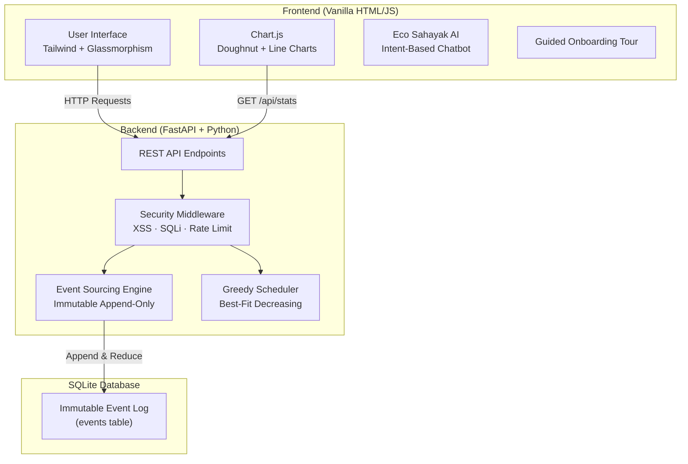

# 🪔 Eco-Ledger: Event-Sourced Carbon Budgeter (Swadeshi Khata)

**Author:** Aryan Baitha (B.Tech CSE, Asansol Engineering College, Batch 2024-2028)

Eco-Ledger (Swadeshi Khata) is a **production-ready, secure, and accessible** web application that helps users track and manage their carbon footprint through an **event-sourcing architecture** and optimize energy usage via a **Best-Fit Decreasing greedy scheduling algorithm**.

---

## 🏗️ Architecture Overview



---

## ✨ Key Features & Technical Highlights

### 1. 📜 Event-Sourcing Architecture
Instead of CRUD updates, every user action is recorded as an **immutable event** in an append-only log. The current carbon budget is dynamically computed by **reducing/summing** these events using Python's `functools.reduce`. This ensures:
- **Full audit trail** — every action is permanently recorded
- **History reconstruction** — browse the complete ledger with running totals
- **Data integrity** — events are never mutated or deleted

### 2. 🧠 Best-Fit Decreasing Greedy Scheduling Algorithm
The task scheduler optimizes heavy appliance usage during off-peak grid hours:
- **Sort** tasks by duration in **descending** order
- For each task, find the **tightest-fitting slot** (smallest slot that can accommodate it)
- This minimizes wasted capacity compared to simple First-Fit approaches
- Reports **slot utilization percentage** for transparency
- **Time Complexity:** O(n × m) | **Space Complexity:** O(n + m)

### 3. 🛡️ Multi-Layer Security
| Layer | Protection |
|-------|-----------|
| **XSS Prevention** | HTML entity escaping on all inputs (frontend + backend) |
| **SQL Injection** | Parameterized queries + character stripping middleware |
| **Rate Limiting** | In-memory per-IP sliding window (60 req/min) |
| **Input Validation** | Max 500 character limit per field |
| **Security Headers** | CSP, HSTS, X-Frame-Options, X-Content-Type-Options, Referrer-Policy, Permissions-Policy |
| **CORS** | Configurable cross-origin resource sharing |

### 4. 📊 Data Visualization (Chart.js)
- **Doughnut Chart** — Emissions vs. Reductions breakdown
- **Line Chart** — 30-day Cumulative carbon footprint over time with daily emissions/reductions overlay
- **Animated stat counters** — Total emitted, total reduced, event count

### 5. ♿ WCAG Accessibility Compliance
- `aria-live="polite"` on dynamic content (budget display, chat, feedback)
- `role` attributes on all sections and interactive regions
- `aria-label` on every button and interactive element
- **Skip navigation** link for keyboard users
- **`<noscript>`** fallback for JavaScript-disabled browsers
- Semantic HTML5 (`<main>`, `<nav>`, `<section>`)

### 6. 🤖 Eco Sahayak — AI Chatbot Assistant
- **12+ intent categories** — budget, charts, history, scheduling, security, tips, etc.
- Typing animation with realistic delay
- Suggestion chips for quick interaction
- Context-aware responses

### 7. 🎓 Interactive Onboarding Tour
- 9-step guided walkthrough with element highlighting
- Automatically triggers for first-time visitors or upon feature updates
- Personalized greeting with name persistence (localStorage)
- Auto-opens AI assistant after completion

---

## 📁 Project Structure

```
eco-ledger/
├── backend/
│   ├── engine.py          # Event sourcing engine + greedy scheduler
│   ├── main.py            # FastAPI app, routes, middleware integration
│   ├── middleware.py       # Security: sanitization, rate limiting, logging
│   └── tests.py           # 19+ unit tests (pytest)
├── frontend/
│   ├── index.html          # Main UI with charts, history table, accessibility
│   └── app.js              # Frontend logic, Chart.js, chatbot, tour
├── .env.example            # Environment variable template
├── .gitignore              # Git ignore rules
├── requirements.txt        # Python dependencies
└── README.md               # This file
```

---

## 🔌 API Documentation

| Method | Endpoint | Description |
|--------|----------|-------------|
| `GET` | `/api/health` | Health check (service status + version) |
| `POST` | `/api/events` | Append a new carbon event to the immutable ledger |
| `GET` | `/api/events` | Retrieve the full event log with running totals |
| `GET` | `/api/budget` | Get the current net carbon budget (reduced from events) |
| `GET` | `/api/stats` | Get aggregated statistics for chart visualization |
| `POST` | `/api/schedule` | Run the Best-Fit Decreasing scheduler on a task queue |

### Example: Add an Event
```bash
curl -X POST http://127.0.0.1:8000/api/events \
  -H "Content-Type: application/json" \
  -d '{"action_type": "Auto Rickshaw Travel", "carbon_impact": 4.5}'
```

### Example: Get Schedule
```bash
curl -X POST http://127.0.0.1:8000/api/schedule \
  -H "Content-Type: application/json" \
  -d '{"tasks": [{"name": "Washing Machine", "duration": 2.0}], "available_slots": [4.0, 2.0]}'
```

---

## 🛠️ Tech Stack

| Component | Technology |
|-----------|-----------|
| **Frontend** | Vanilla HTML, CSS (Tailwind via CDN), JavaScript |
| **Charts** | Chart.js 4.4 (via CDN) |
| **Backend** | Python 3.9+ with FastAPI |
| **Database** | SQLite (`sqlite3` built-in) |
| **Testing** | Pytest (19+ tests) |
| **Fonts** | Google Fonts (Outfit) |

---

## 🚀 Running the Application

### Prerequisites
*   Python 3.9+

### Setup
1.  Clone the repository and navigate to the `eco-ledger` directory.
2.  Create a virtual environment: `python -m venv venv`
3.  Activate the virtual environment:
    *   Windows: `venv\Scripts\activate`
    *   macOS/Linux: `source venv/bin/activate`
4.  Install dependencies: `pip install -r requirements.txt`
5.  Copy `.env.example` to `.env` (optional).

### Run the Backend Server
```bash
uvicorn backend.main:app --reload
```
The API will be available at `http://127.0.0.1:8000`.

### Open the Frontend
Simply open the `frontend/index.html` file in your preferred web browser.

---

## 🧪 Testing

To run the comprehensive test suite (19+ tests covering event sourcing, scheduling, security, and edge cases):

```bash
pytest backend/tests.py -v
```

### Test Categories
| Category | Tests | What's Tested |
|----------|-------|---------------|
| Event Sourcing Math | 4 | Budget calculation, empty state, negative budget, 150-event stress test |
| Audit Trail | 3 | Full history retrieval, running totals, empty state, aggregated stats |
| Greedy Scheduler | 5 | Best-fit placement, empty tasks, all-fit, none-fit, single task |
| Security | 5 | XSS escaping, SQL injection chars, normal text preservation, length limits, rate limiter |

---

## 📄 License

This project was created for educational and hackathon purposes.
